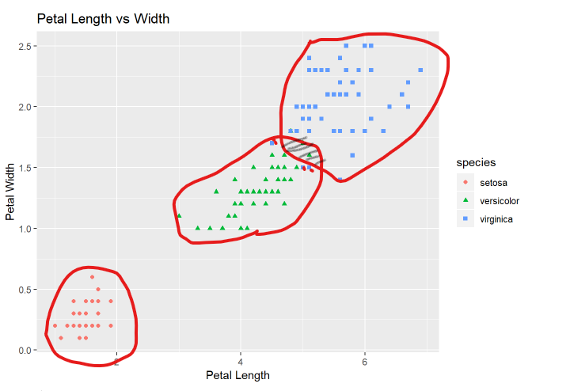

```{r setup, include=FALSE}

library(readr) #file reading functions
if(!require(tidyverse)) install.packages("tidyverse") 
if(!require(tidyr)) install.packages("tidyr")
if(!require(stringr)) install.packages("stringr") #string operation functions
if(!require(ggplot2)) install.packages("ggplot2") #plotting library
if(!require(plyr)) install.packages("plyr")


library(caret)
library(purrr)
library(ggplot2)
library(tidyverse)
library(dplyr)
```

## Introduction to machine learning
The Data Science course on EDX by Harvard has introduced me to some core data science concepts, i am certainly not yet a seasoned data scientist but with the little knowledge i have received from the course i will attempt to demonstrate machine learning through this ML capstone project.
This ML projects offer you a a slightly naive approach to training and testing a Machine Learning algorith to categorise some images. 

## Problem Statement

At my current job, we recently engaged a suplier to digitize all our client documents. one of the requirements was to categorise documents based on type and unit and at the same time embed metadata elements. Their approach was to have human workers look through each and every document and categorize it, the project was for 140,000 files and on average each file has 30 different document types varying in content and structure which can be 1 of multiple types(approximately 42 not counting emails and unstructured documents). I saw this as a total waste of time and resources, this is something that could be done more efficiently using a well trained algorithem. While I am miles away from this, this will be a great way to learn. 
Bingo! We have a great problem to implement a classification algorithm, this would have been a brillian project but taking a few steps back i realized i could not proceed with that given the timelines and the project requirements that data is available for peer review, so i went for the next BIG thing, Iris.
This project will attempt a very naive classification algorithm.

## Dataset overview
There are very many datasets out in the wild however for a learning algorithm for image recognition and simple enough for a learner new to R and machine learning, the Iris data set is perfect. 
Description and download of the iris dataset can be found at https://archive.ics.uci.edu/ml/datasets/Iris


## Getting the data
We are going to download the data and save it in our working directory inside data directory. We could simply do data(iris) and be done with that, but a real project would involve some data imports of sort. So we emulate this, but first some house keeping
## do some housekeeping
```{r prerequisites: dataset}

# get curent working directory
cwd <- getwd()
dataSourceUrl <- "https://archive.ics.uci.edu/ml/machine-learning-databases/iris/iris.data"

print(paste("the curent working directory is ",cwd))
# check if the data directory exists
datadir <- "data"
if(!dir.exists(file.path(cwd, datadir))){
  print("data direcory does not exist it will be created")
  #a try catch statement can help raise a warning if there are permission issues
  dir.create(file.path(cwd, datadir))
}else{
  print("directory structure is ok we will now download iris dataset")
}
datapath <- file.path(cwd, datadir)
dataFilePath <- file.path(datapath, 'iris.data')
dataFilePath
if(file.exists(dataFilePath)){
  print("data file exists")
} else {
  print("data file does not exist, we will download it to the data directory")
  download.file(dataSourceUrl, dataFilePath)
}
# Load iris dataset

#conventional knowledge tells us this is a csv that does not have headers but we will preview it all the same
irisCsv <- read_csv(dataFilePath, col_names = c('sepal_length_cm','sepal_width_cm','petal_length_cm','petal_width_cm', 'species'), col_types = list(sepal_length_cm = col_double(),  sepal_width_cm =col_double(),  petal_length_cm = col_double(),  petal_width_cm = col_double(),  species = col_factor(c("Iris-setosa","Iris-versicolor", "Iris-virginica"))))

head(irisCsv, 6)


# data was imported as list, we would like it as tible or dataframe
# we can assign collumn names here as well
irisDf <- data.frame(irisCsv)
names(irisDf) <- c('sepal_length_cm','sepal_width_cm','petal_length_cm','petal_width_cm', 'species')

```
## Data cleaning and wrangling 
this dataset is a relatively clean we do not need to do cleaning
we will replace all occurance of Iris before the species name instean
```{r data clean}
irisDf <- irisDf %>% mutate(species = str_replace(species, 'Iris-', ''))

```
## Data exploration and Summary
This will give us a basis for our assumption in the classification

```{r summarise}
summary <- irisDf %>% dplyr::group_by(species) %>% dplyr::summarise(	avg_sepl = mean(sepal_length_cm), sd_sepl = sd(sepal_length_cm), avg_sepw = mean(sepal_width_cm), sd_sepw=sd(sepal_width_cm),
	avg_petl = mean(petal_length_cm), sd_petl = sd(petal_length_cm),
	avg_petw = mean(petal_width_cm), sd_petw = sd(petal_width_cm))
summary
# Now we check the Sepal Length vs Width. Notice the sepal dimensions for the Virginica and Versicolor species are relatively similar, this feature might not be a good predictor.
irisDf %>% ggplot(aes(x = sepal_length_cm, y = sepal_width_cm)) +
  geom_point(aes(color=species, shape=species)) +
  xlab("Sepal Length") + 
  ylab("Sepal Width") +
  ggtitle("Sepal Length vs Width")

irisDf %>% ggplot(aes(x = petal_length_cm, y = petal_width_cm)) +
  geom_point(aes(color=species, shape=species)) +
  xlab("Petal Length") + 
  ylab("Petal Width") +
  ggtitle("Petal Length vs Width")
```
<br>


</br> With this simple scatter plot some patterns/features begin to emerge in covarriance of the two variables of the petal feature, we can use as a basis for our classification 

## Creating a model

## Split the data to Training and Test sets

```{r simplemodel}
#define our observations
y <- irisDf$species
set.seed(2)

test_index <- createDataPartition(y,times=1,p=0.4,list=FALSE)

test <- irisDf[test_index,]

train <- irisDf[-test_index,]


```


## Training the Model
We will train a simple model using the discoveries we have made so far
```{r training }
petl_cutofs <- seq(min(train$petal_length_cm), max(train$petal_length_cm), 0.1)
petw_cutofs <- seq(min(train$petal_width_cm), max(train$petal_width_cm), 0.1)

print(petw_cutofs)

petl_accu <- map_dbl(petl_cutofs, function(x){
	y_hat <- ifelse(train$petal_length_cm < x, "setosa", {ifelse(train$petal_length_cm > x, "virginica", "versicolor")} ) 
	#%>% factor(levels = levels(test$species))
	mean(y_hat == train$species)
})
mean(petl_accu)

petw_accu <- map_dbl(petw_cutofs, function(x){
	y_hat <- ifelse(train$petal_width_cm < x, "setosa", { ifelse( train$petal_width_cm > x , "virginica", "versicolor" )})
	#%>% factor(levels = levels(test$species))
	mean(y_hat == train$species)
})

#we mutate the df and add the coefficient of variation that we can use in our classifier

summary %>% mutate(cv_petl= sd_petl/avg_petl,cv_petw= sd_petw/avg_petw) %>% select(cv_petw, cv_petl)

```
## Obtain the Best cutoff
Accuracy for the algorithm is:
```{r cutoff }
print(petw_accu)

print(petl_accu)

print(max(petw_accu))

print(max(petl_accu))
#Petal Width
best_cutof_w <- petw_cutofs[which.max(petw_accu)]
print(best_cutof_w)

#Petal Length best cutoff
best_cutof_l <- petl_cutofs[which.max(petl_accu)]
print(best_cutof_l)
```
</br>
##plot the results of the cutoffs
```{r accuracy_cutoff plot }
df_w <- data.frame(accuracy = petw_accu, cutofs = petw_cutofs)
df_l <- data.frame(accuracy = petw_accu, cutofs = petw_cutofs)
ggplot() + 
  geom_line(data = df_l, aes(x = cutofs, y = accuracy), color = "blue") +
  geom_line(data = df_w, aes(x = cutofs, y = accuracy), color = "red") +
  xlab('Cutoff') +
  ylab('Accuracy')


```
## Testing themodel on the Test Set


## Conclussion 
This script implemented a simple naive classification algorithm for classifying Iris flowers based on the petal length or petal width in isolation, the algorithm can be further modified to put into account both petal length and width as attributes.


